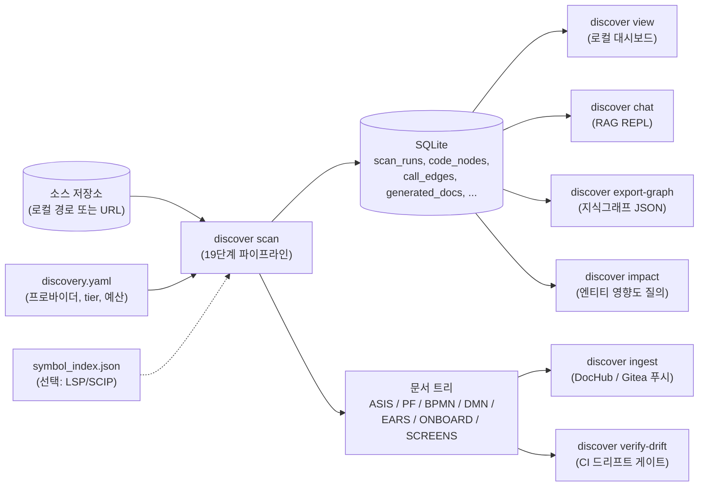
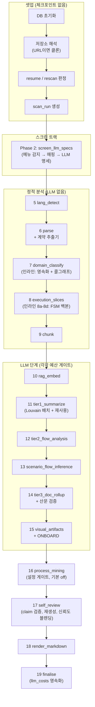
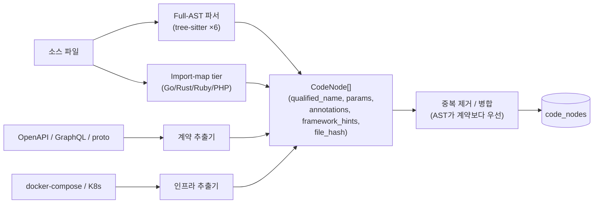
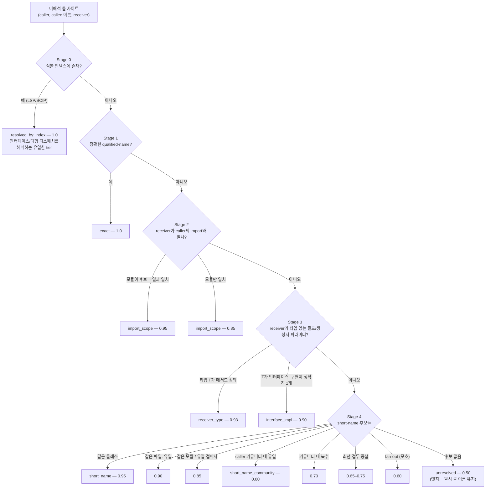
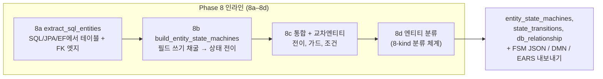
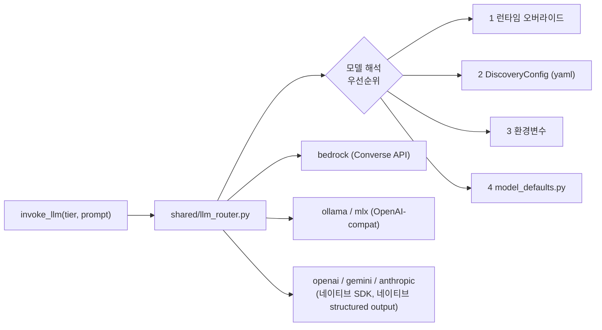
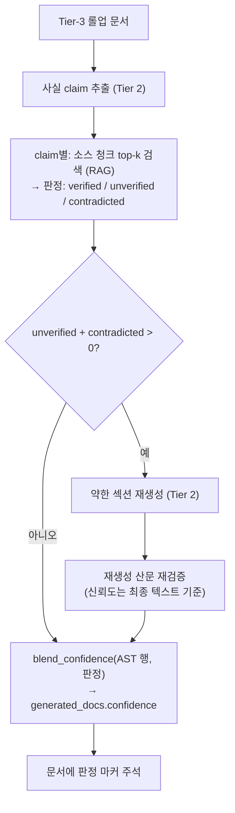
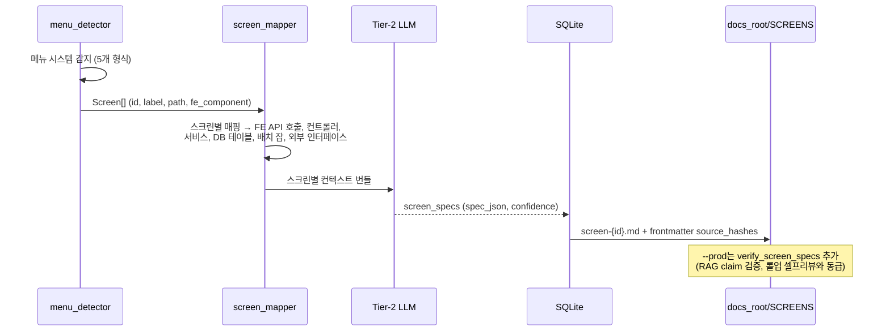

# AI-Discovery — 시스템 로직 리뷰 문서

**대상**: IT 개발자팀 (엔지니어링 리뷰)
**작성일**: 2026-06-06
**근거**: `main` @ 7a109a9 시점의 코드. 아래 모든 구체적 주장은 인용된 모듈에서 직접 검증했으며, 라인 번호는 근사치로 변동될 수 있음.
**영어 정본**: [system-logic.md](system-logic.md)

---

## 목차

1. [시스템 개요](#1-시스템-개요)
2. [엔드투엔드 파이프라인](#2-엔드투엔드-파이프라인)
3. [파싱 레이어](#3-파싱-레이어)
4. [콜그래프 해석](#4-콜그래프-해석)
5. [엔티티 / FSM 백본](#5-엔티티--fsm-백본)
6. [LLM 레이어](#6-llm-레이어)
7. [RAG & 셀프리뷰 루프](#7-rag--셀프리뷰-루프)
8. [스크린 중심 트랙](#8-스크린-중심-트랙)
9. [생성기 & 아티팩트](#9-생성기--아티팩트)
10. [데이터 모델](#10-데이터-모델)
11. [신뢰도 모델](#11-신뢰도-모델)
12. [운영 특성](#12-운영-특성)
13. [알려진 한계 & 리뷰 논점](#13-알려진-한계--리뷰-논점)

---

## 1. 시스템 개요

AI-Discovery는 **브라운필드(레거시) 역공학 엔진**이다. 소스 저장소를
입력으로 받아 SDLC 문서를 출력한다: As-Is 명세, 프로세스 플로우,
BPMN/DMN/EARS 아티팩트, 스크린 명세, 온보딩 투어 가이드, 그리고 질의
가능한 지식 그래프 — 모든 중간 결과는 신뢰도 점수와 함께 SQLite에
기록된다.

이 시스템이 관리하는 핵심 긴장 관계는 **결정적 정적 분석**(파싱,
콜그래프, FSM 마이닝 — 저렴하고 정확하지만 불완전)과 **LLM 추론**(요약,
플로우 서사, 문서 산문 — 비싸고 유창하지만 오류 가능)의 결합이다.
정적 분석이 사실(fact) 백본을 구축하고, 3-tier LLM 파이프라인이 그
백본에 *제약된* 산문을 작성하며, 셀프리뷰 단계가 RAG를 통해 산문을
백본과 소스 코드에 *대조 검증*하여 그 판정을 공표 신뢰도 점수로
블렌딩한다.



**핵심 경계 결정**

| 경계 | 결정 |
|---|---|
| 파이프라인은 푸시하지 않음 | `discover scan`은 `docs_root`에 마크다운만 기록; 게시는 별도의 `discover ingest` 단계. |
| DB가 시스템의 기록 원본 | 디스크의 마크다운은 DB 행(`generated_docs`, `scenario_flows`, …)의 *렌더링*. 재렌더링은 저렴하고, LLM 작업은 체크포인트로 보호. |
| 신뢰도는 절대 자기주장이 아님 | LLM이 출력한 "Confidence: X" 줄은 파싱하되 **절대 공표하지 않음**; 공표 신뢰도는 결정적 검증에서만 나옴 (§11). |

---

## 2. 엔드투엔드 파이프라인

### 2.1 단계(Phase) 맵

정식 단계 목록은 `src/ai_discovery/pipeline.py:54`의 `_PHASE_SPECS`.
단계 번호는 연속 정수이며, 체크포인트 없는 인라인 작업은 코드 주석에서만
문자 접미사(8a–8d)로 표기된다.

| # | 이름 | 역할 | LLM tier | 게이트 |
|---|---|---|---|---|
| – | (셋업) | DB 초기화, 저장소 해석, resume/rescan 판정, scan_run 생성 | – | – |
| 2 | `screen_llm_specs` | 스크린 중심 트랙: 메뉴 감지 → 스크린→백엔드 매핑 → 스크린별 LLM 명세 (§8) | Tier 2 | 예산; 메뉴 미감지 시 스킵 |
| 5 | `lang_detect` | 확장자 기반 언어 통계 | – | – |
| 6 | `parse` | 전체 소스 파싱 → `CodeNode`; 계약 추출(OpenAPI/GraphQL/gRPC); 중복 제거 | – | – |
| 7 | `domain_classify` | 도메인 분류; **인라인**: 노드 영속화, 콜그래프 구축(§4), 외부 시스템 추출 | – | – |
| 8 | `execution_slices` | 진입점 기준 유계 BFS 슬라이스 → `Scenario`; **인라인 8a–8d**: SQL 엔티티, FSM 마이닝, 교차엔티티 전이, 엔티티 분류 (§5) | – | – |
| 9 | `chunk` | Tier 1 + RAG용 코드 청킹 (`config.rag` 필터 준수); 이후 소스 텍스트 메모리 해제 | – | – |
| 10 | `rag_embed` | 청크 임베딩 → `sqlite-vec`(`discovery_vectors`); chunk-hash 증분 | embedding | 예산 |
| 11 | `tier1_summarize` | 노드별 구조화 요약; **Louvain 의미 배칭** + **fingerprint 교차스캔 재사용** (§6.4, §12.2) | Tier 1 | 예산 |
| 12 | `tier2_flow_analysis` | 도메인별 비즈니스 플로우 | Tier 2 | 예산 |
| 13 | `scenario_flow_inference` | 실행 슬라이스에서 시나리오 플로우 재구성; `--prod`는 플로우 검증 추가 | Tier 2 | 예산 |
| 14 | `tier3_doc_rollup` | 도메인별 SDLC 문서(`as-is`, `as-is-detail`, `as-is-schema`); 결정적 산문 검증이 검증불가 `file:line` 인용 플래그 | Tier 3 | 예산 |
| 15 | `visual_artifacts` | 시나리오별 Mermaid 시퀀스/플로우차트, BPMN XML, IPO 마크다운; ONBOARD 투어 가이드 | Tier 2 (onboard 서사) | 예산 (onboard) |
| 16 | `process_mining` | 프로세스 마이닝 & 정합성 리포트 | – | `process_mining.enabled` (기본 off) |
| 17 | `self_review` | RAG 대조 claim 검증; 약한 섹션 재생성; 신뢰도 블렌딩 (§7, §11) | Tier 2 | 예산 |
| 18 | `render_markdown` | 모든 마크다운을 `docs_root`에 기록 | – | – |
| 19 | `finalise` | 스캔 완료 마킹; 비용 원장 영속화; 요약 출력 | – | – |

### 2.2 게이트 포함 흐름



**예산 게이팅** (`pipeline.py:_budget_ok`): 각 LLM 단계 진입 전, 누적
비용 ≥ `budget_limit_usd`이면 경고와 함께 단계를 스킵하고 스캔은
`budget_exceeded` 상태로 종료된다. tier 루프에는 단계 중간 중단용
프레디킷(`_budget_exhausted_fn`)도 전달된다. 비용 추적은 종량제 클라우드
프로바이더 대상이며 로컬 프로바이더는 무료 처리된다 (모델별 단가, §6.3).

**체크포인팅**: 각 단계는 `phase_checkpoints` 행(`running` →
`complete`/`failed`)을 기록한다. `--resume`은 마지막 완료 체크포인트
다음부터 계속; `--resume-from <n|name>`은 지정 단계로 점프;
`--skip-phases`는 스킵. 저렴한 파생 단계(8, 9)는 영속화 대신 재구축한다.

---

## 3. 파싱 레이어

언어 지원은 2개 tier로 나뉘며, 코드와 무관하게 API 정의를 채굴하는 계약
추출기가 별도로 있다.

### 3.1 Full-AST tier (tree-sitter)

| 언어 | 모듈 | 주요 추출 |
|---|---|---|
| Python | `parsers/python_parser.py` | 데코레이터 기반 Flask/FastAPI 엔드포인트, ORM 모델, 상태머신 |
| Java / Spring | `parsers/java.py` | `@RestController`/`@RequestMapping` 엔드포인트, DI 타입 힌트, 중첩 타입 |
| C# / ASP.NET | `parsers/csharp.py` | attribute, EF 내비게이션 프로퍼티 |
| JavaScript / TypeScript | `parsers/javascript.py` | export/import, 클래스, 화살표 함수, 라우터 상수 |
| WebForms | `parsers/webforms.py` | `.aspx` 페이지 + code-behind 클래스 |
| JSP | `parsers/jsp.py` | `.jsp/.jspx` 페이지, include, useBean 바인딩 (`jsp_extractor.py`) |

### 3.2 Import-map tier (A-6, 정규식 기반)

`parsers/import_map.py` — **Go, Rust, Ruby, PHP**. 보수적 정규식으로
최상위 심볼과 import를 추출하며, 콜 사이트는 리시버가 명시된 경우만
수집한다. 모듈 구분자는 점으로 정규화되어(`a/b` → `a.b`, `a::b` → `a.b`,
`A\B` → `A.B`) Stage-2 import-scoped 콜 해석(§4)이 언어와 무관하게 동일
동작한다. 이는 full AST와 동급이 아닌 **진입로(on-ramp)**다: 신뢰도
상한이 낮고, 이 언어들에는 엔드포인트/FSM 추출이 없다.

### 3.3 계약 추출기

| 추출기 | 입력 | 출력 |
|---|---|---|
| `extractors/openapi_extractor.py` | OpenAPI/Swagger 파일 | 엔드포인트 노드, `(method, route)` 기준 AST 엔드포인트와 중복 제거 |
| `extractors/graphql_extractor.py` | GraphQL 스키마 | 루트 오퍼레이션 → 엔드포인트; 타입 → 엔티티 |
| `extractors/proto_extractor.py` | protobuf | 서비스/RPC → 엔드포인트; 메시지 → 엔티티 |
| `extractors/external_system_extractor.py` | 코드 (axios/kafka/redis/stripe/… 콜 사이트) | 타입화된 외부 시스템 노드 + 엣지 |
| `extractors/infra_extractor.py` | docker-compose / K8s 매니페스트 | 백킹 서비스 노드 |



모든 `CodeNode`는 `file_hash`(파싱 시점 파일의 SHA-256)를 갖는다 — 증분
재스캔(§12.2)을 가능하게 하는 키.

---

## 4. 콜그래프 해석

`src/ai_discovery/graph/call_graph.py:build_call_graph`. 난제: 같은 짧은
이름이 여러 모듈에 존재하고, 동적 디스패치는 정적으로 해석 불가.
해법은 **단계적 캐스케이드 — 첫 매치 승리, 고정밀 단계 우선 — 와 등급화된
신뢰도**다. 다운스트림 소비자가 각자 임계값을 선택할 수 있다 (BPMN은
0.65 수용 가능; 기술 명세는 인간 리뷰 플래그).

### 4.1 해석 캐스케이드



모든 엣지는 출처 추적용 `metadata["resolved_by"]`를 기록하며,
`(caller, callee, edge_type)` 기준으로 **최고 신뢰도만 남기고 중복
제거**된다.

### 4.2 커뮤니티 협소화 (A-3)

노이즈가 많은 short-name 단계를 2-pass 방식으로 제약한다:

1. **Pass 1** — 고신뢰 엣지(stage 0–3, 신뢰도 ≥ 0.93)만으로 union-find
   하여 *파일 커뮤니티* 구축. short-name 단계가 자기 입력을 스스로
   생성하는 일이 없다.
2. **Pass 2** — stage 4에 복수 후보가 있을 때, **커뮤니티가 정보력이
   있는 경우에만**(일부 후보만 내부에 존재) caller의 커뮤니티로 제한.
   커뮤니티 내 유일 → 0.80; 복수 → 0.70.

### 4.3 인덱스 구조

| 인덱스 | 형태 | 사용처 |
|---|---|---|
| `qualified_index` | qualified name → 노드 (1:1) | Stage 1 |
| `short_name_index` | 이름 → [노드들] (1:n) | Stage 2–4 |
| `field_types_by_class` | 클래스 → {필드: 타입} | Stage 3 (DI) |
| `impls_by_base` | 인터페이스/베이스 → [구현체들] | Stage 3 폴백 |

### 4.4 실행 슬라이스

`ExecutionSliceBuilder`(`call_graph.py:581`)는 각 진입점(HTTP 엔드포인트,
배치 잡, CLI 커맨드, 이벤트 컨슈머)에서 해석된 그래프를 **유계 BFS(최대
깊이 5)**로 순회해 `Scenario`를 만든다. 방문 노드마다 **다중 신호 랭킹
점수**(0–1 신뢰도가 아님 — §11.2)를 부여한다: 콜 순서, 상태 전이, 데이터
경계, 외부 API, read-after-write. 최고 점수 노드들(최대 15개)이
시나리오의 `primary_path`가 되고, 조건부 fan-out은 대안 경로/게이트웨이가
된다.

---

## 5. 엔티티 / FSM 백본

인라인 작업 8a–8d(phase 8 내부, 별도 체크포인트 없음)가 **state-first
백본**을 구축한다: 어떤 비즈니스 엔티티가 존재하고, 어떤 상태를
거치며, 어떤 코드가 상태를 움직이는가.



- **8a** — SQL DDL + ORM 모델에서 엔티티와 `db_relationship` 행 도출
  (FK 엣지, `source ∈ {sql, jpa, ef}`; 네이밍 컨벤션 추정은 `inferred=1`
  마킹).
- **8b** — 필드 쓰기 패턴(`status = 'PAID'` 류)에서 상태 전이를 채굴;
  각 전이는 트리거 함수, 가드 표현식, 진입점을 동반.
- **8c** — `fsm_identity.py`로 파일/저장소 간 엔티티 통합(안정적
  `entity_id`); 교차엔티티 전이와 가드 조건 파싱.
- **8d** — 모든 엔티티에 8-kind 분류 체계 중 하나 부여
  (`graph/entity_classifier.py`); 모든 kind가 BPMN에 등장(레인은 엔티티가
  아닌 액터 — kind를 건너뛰지 않음).

이 백본이 `discover impact <Entity>`, DMN 결정 테이블, EARS 요구사항
템플릿, `discover federate`(필드-Jaccard 유사도 기본 0.7 기준 교차저장소
FSM 병합)를 구동한다.

---

## 6. LLM 레이어

### 6.1 프로바이더 × tier 슬롯

7개 프로바이더, 모두 동일한 4개 모델 슬롯 + 임베딩을 노출:

| 프로바이더 | tier1 | tier2 | tier3d | tier3p | 임베딩 |
|---|---|---|---|---|---|
| bedrock | ✓ | ✓ | ✓ | ✓ | ✓ |
| ollama | ✓ | ✓ | ✓ | ✓ | ✓ |
| mlx-gemma / mlx-qwen | ✓ | ✓ | ✓ | ✓ | OpenAI-compat 경유 |
| openai | ✓ | ✓ | ✓ | ✓ | ✓ |
| gemini | ✓ | ✓ | ✓ | ✓ | ✓ |
| anthropic | ✓ | ✓ | ✓ | ✓ | **✗** (별도 `rag.embedding_provider` 필요) |

슬롯 의미: **tier1** = 대량 노드 요약(저렴/고속); **tier2** = 플로우
분석, 시나리오 추론, 스크린 명세, 셀프리뷰; **tier3d** = 문서 롤업
(기본); **tier3p** = `--prod` 시 문서 롤업(고성능 모델). `--prod` 모델이
계정에서 비활성이면 **모든 롤업이 실패하면서도 스캔은 0으로 종료**하는
운영 함정이 있다 (CLAUDE.md "Common Tasks" 참조).

### 6.2 라우팅



라우터와 비용 원장이 쓰는 내부 tier 이름: `fast`(tier1),
`standard`(tier2), `expert`(tier3 활성), `heavy`(tier3p), `embedding`.

### 6.3 Structured output & 비용

- `LLMClient.invoke_structured(tier, prompt, response_type)`는
  프로바이더별 **tool-use / 네이티브 JSON 모드**를 사용하고, JSON 추출
  폴백(`ai/json_extract.py`)을 둔다. 검증 오류는 콜 레이어에서 재시도.
- 비용은 **(tier, model)별** 모델 단가로 추적; 로컬 프로바이더는 무료.
  `llm_costs`(`UNIQUE(scan_id, tier)`)에 영속화되고 예산 게이트(§2.2)가
  강제한다.

### 6.4 Louvain 의미 배칭 (A-1)

`ai/semantic_batching.py`: phase-7 콜 엣지를 신뢰도 가중 파일 그래프로
축약하고, `networkx.louvain_communities`로 분할한 뒤, **커뮤니티당 1회의
구조화 Tier-1 호출**을 수행한다 (상한: 배치당 10청크 / 12k 토큰; 소형
배치는 도메인별 풀링). 요약기가 청크를 고립된 조각이 아니라 caller/callee
맥락과 함께 보게 된다. 실패 시 결정적 도메인/경로 그룹핑으로 **시끄럽게**
강등된다 — Tier 1은 절대 크래시하거나 청크를 누락하지 않는다.

### 6.5 Ollama 수명주기

로컬 프로바이더는 단계에 걸쳐 모델을 메모리에 고정(`warm(tier,
keep_alive=2h)`, phase 10/12/14 전)하고 tier 전환 시
해제(`unload`)하여 VRAM을 제한한다.

---

## 7. RAG & 셀프리뷰 루프

### 7.1 임베딩 저장소

`rag/embedder.py`: 청크 → 임베딩 → **sqlite-vec** 가상 테이블
`discovery_vectors`(`vec0`, float[dim]) + `discovery_chunk_meta`(파일
경로, qualified name, 도메인, 청크 텍스트, `chunk_hash`). 재임베딩은
**chunk-hash 증분**: 해시 동일 ⇒ 임베딩 동일(호출 없음); 차원 변경 시
강제 재생성. `rag/retriever.py`가 코사인 top-k 검색.

### 7.2 셀프리뷰 (phase 17)



운영 가드: 문서당 타임아웃 300초(ThreadPoolExecutor); 판정은
`review_claims`에 영속화; phase-14의 **산문 검증**은 리뷰 *전에* 돌며
순수 결정적이다 — 파싱된 그래프에 존재하지 않는 `file:line` 인용과
qualified 심볼을 플래그한다.

다운스트림 `/discover-triage` 스킬이 정확히 이 출력을 소비한다:
`confidence < 0.65`이거나 claim 상태가
`('contradicted','unverified')`인 행만 유계 인간 리뷰 대상.

---

## 8. 스크린 중심 트랙

Phase 2 — **사용자 대면 진입점으로서의 스크린 명세**를 생성하며, 도메인
문서로 링크아웃한다 (대체가 아님).

### 8.1 메뉴 감지 (5개 형식, 우선순위 순, 첫 매치 승리)

1. JSON/YAML 메뉴 파일 (`menu.json`, `navigation.yaml`) — leaf 항목만
2. TS/JS 메뉴 상수 (`export const MENU = [...]`) — `route_parser.py` 경유 tree-sitter
3. 프레임워크 라우팅 — Vue Router, React Router(JSX `<Routes>` 포함), Angular
4. WebForms — `.aspx` 페이지, 폴더 계층 = 메뉴 (폴백)
5. JSP — `.jsp/.jspx` 페이지, 폴더 계층 = 메뉴 (폴백)

아무것도 매치하지 않으면 `detect_and_build_screens`가 시도한 모든 형식을
로그로 남기고 스크린 생성을 스킵한다 — **무음 0-스크린 실행은 절대
없다**. 비메뉴 스크린(모달, 위저드, 딥링크, 역할 조건부)은 알려진 공백
(§13).

### 8.2 흐름



### 8.3 드리프트 감지

각 명세의 frontmatter에 `source_hashes`(경로 → 의존 소스 파일의
SHA-256)가 있다. `discover verify-drift`가 현재 파일을 재해싱해 하나라도
다르면 비-0으로 종료한다 — *드리프트된 명세만* 재생성을 트리거하는 CI
게이트.

---

## 9. 생성기 & 아티팩트

모든 생성기 모듈은 `src/ai_discovery/generators/`에 있다 (주의:
`output/`은 gitignore 대상 — 모듈을 거기 두지 말 것).

| 생성기 | 아티팩트 |
|---|---|
| `doc_generator.py` | ASIS 롤업 + 시나리오 PF 문서 디스크 기록; doc-type → 폴더 버킷팅 |
| `bpmn_generator.py` | Mermaid 시퀀스 + 플로우차트, BPMN 2.0 XML, IPO 마크다운, 엔티티 백본 Mermaid |
| `dmn_generator.py` | 가드 있는 전이에서 DMN 결정 테이블 |
| `ears_generator.py` | 상태 변화에서 EARS 요구사항 템플릿 |
| `onboarding_generator.py` | ONBOARD 투어 가이드 — 결정적 콜그래프 워크 + Tier-2 서사, `ONBOARD/{slug}-onboard-{domain}.md` |
| `screen_doc_writer.py` | 드리프트 frontmatter 포함 스크린별 마크다운 |
| `graph_export.py` | 정식 지식그래프 JSON (`discover export-graph`) |
| `push.py` | DocHub / Gitea 게시 (`discover ingest`가 사용) |

출력 트리:

```text
docs_root/output-{slug}/
  ASIS/      as-is*.md                  (도메인 롤업)
  ASSD/      as-is-schema*.md           (스키마 상세)
  PF/        process-flow-*.md          (시나리오: Mermaid + BPMN + IPO)
  EARS/      entity-ears.md
  DMN/       entity-decisions.md
  ONBOARD/   {slug}-onboard-{domain}.md
  SCREENS/   screen-*.md                (source_hashes frontmatter 포함)
  entity_state_machines.json / cross_entity_transitions.json
  entity_backbone.mmd
  knowledge-graph-{slug}.json           (export-graph)
```

다이어그램 전략 (기록된 결정): **Mermaid 우선**(GitHub/GitLab/Gitea
네이티브 렌더링), BPMN XML + bpmn.io 보조; draw.io / PlantUML / D2는
기각.

---

## 10. 데이터 모델

SQLite, `SCHEMA_VERSION = 14` (`src/ai_discovery/db.py`), WAL 모드.
핵심 관계:

```mermaid
erDiagram
    scan_runs ||--o{ code_nodes : "scan_id"
    scan_runs ||--o{ call_edges : "scan_id"
    scan_runs ||--o{ domains : "scan_id"
    scan_runs ||--o{ generated_docs : "scan_id"
    scan_runs ||--o{ scenario_flows : "scan_id"
    scan_runs ||--o{ screens : "scan_id"
    scan_runs ||--o{ entity_state_machines : "scan_id"
    scan_runs ||--o{ llm_costs : "scan_id"
    scan_runs ||--o{ phase_checkpoints : "scan_id"
    code_nodes ||--o{ call_edges : "caller_id / callee_id"
    code_nodes ||--o{ node_summaries : "node_id"
    generated_docs ||--o{ review_claims : "doc_id"
    screens ||--o{ screen_specs : "screen_id"
    screens ||--o{ screen_source_hashes : "screen_id"
    entity_state_machines ||--o{ state_transitions : "entity_id"

    code_nodes {
        string qualified_name
        string node_type
        string domain
        string file_hash "SHA-256, A-2 재사용 키"
    }
    call_edges {
        float confidence "0.5 - 1.0"
        string resolved_by "index|exact|import_scope|..."
    }
    generated_docs {
        string doc_type "as-is | as-is-detail | as-is-schema | ..."
        float confidence "블렌딩 값, 자기주장 아님"
        string push_status "local | pushed | failed"
    }
    review_claims {
        string status "verified | unverified | contradicted"
    }
    scenario_flows {
        string structured_steps_json "PHASE/LOOP/GATEWAY/PROCESS 트리"
        string bpmn_xml
        string mermaid
    }
    entity_state_machines {
        string entity_id "교차스캔 안정 식별자"
        string metadata_json "entity_kind, denormalized_fields"
    }
    db_relationship {
        string source "sql | jpa | ef"
        int inferred "1 = 네이밍 컨벤션 추정"
    }
    llm_costs {
        string tier "fast|standard|expert|heavy|embedding"
        float est_usd
    }
```



표시 생략 보조 테이블: `business_flows`(tier-2 플로우),
`state_transitions` 원시 행, `schema_version`, 그리고 RAG 저장소
(`discovery_vectors` sqlite-vec 가상 테이블 + `discovery_chunk_meta`).

`scan_runs.status` 수명주기:
`running → llm_complete → completed` | `push_failed` | `budget_exceeded`.

---

## 11. 신뢰도 모델

서로 *다른* 3개의 신뢰도 체계 — 같은 단어, 다른 의미. 리뷰어는 구분해서
다뤄야 한다.

### 11.1 콜 엣지 신뢰도 (0.5–1.0)

매치된 해석 단계가 결정 (§4.1). 의미: 이 엣지가 올바른 callee를 가리킬
확률. 소비자가 임계값을 선택한다 (프로젝트 목표: 0.65 미만 엣지 ≤ 15%).

### 11.2 실행 노드 점수 (상한 없는 랭킹 점수 — *0–1 아님*)

`ExecutionSliceBuilder._score_node` (`call_graph.py:670`):

```text
score = max(0, 5 − depth)            # 콜 순서: 진입점 +5, 레벨당 −1
      + 4   상태 전이 존재 시
      + 3   노드 타입 ∈ {DB, QUEUE}
      + 2   노드 타입 = EXTERNAL_API
      + 3   read-after-write (업스트림에서 쓴 필드를 노드 이름이 언급)
```

`ExecutionNode.confidence`에 저장되지만 **≤ 15개 `primary_path` 선정
랭킹에만** 사용된다. 11.1/11.3과 비교하지 말 것.

### 11.3 문서 신뢰도 (0.0–1.0, 공표 값)

`ai/rollup.py:blend_confidence` — AST 검증 행과 셀프리뷰 판정의 결정적
블렌딩:

```text
n_ast   = AST 검증 행 수 (엔드포인트, 필드 목록)       → 각 가중치 1.0
verified / unverified / contradicted claim             → 1.0 / 0.5 / 0.0

confidence = (n_ast + verified·1.0 + unverified·0.5 + contradicted·0.0)
             ───────────────────────────────────────────────────────────
                          n_ast + verified + unverified + contradicted

분모가 0이면 → UNVERIFIABLE_CONFIDENCE = 0.3
```

셀프리뷰가 안 돈 경우(예산/스킵): `unreviewed_confidence` = AST 사실이
있으면 **0.6**, 없으면 **0.3**. 리뷰에서 지킬 가치가 있는 2개 불변식:
(a) LLM의 자기주장 신뢰도 줄은 절대 공표하지 않는다; (b) "근거 없음"은
높은 신뢰도가 아니라 *낮은* 신뢰도로 매핑된다 — claim조차 추출되지 않은
문서가 확실한 것처럼 출고되어선 안 된다.

스크린 명세는 기본 0.8이고 `--prod` 검증 후 갱신된다.

---

## 12. 운영 특성

### 12.1 Resume & rescan

- `--resume` — 마지막 완료 `phase_checkpoints` 행 다음부터 계속.
- `--rescan` 동일-SHA 패스트패스 — 커밋이 동일하고 이전 스캔이
  완료되었으며 캐시된 문서가 존재하면, 파싱과 **모든 LLM tier를
  스킵**하고 DB에서 마크다운만 재렌더링.
- `--skip-phases` — 명시적 스킵; phase 8–9는 필요 시 저렴하게 재구축.

### 12.2 증분 재스캔 (A-2)

Tier-1 요약 전에 `reuse_prior_summaries`가 최신 이전 스캔에서
`(qualified_name, file_path, file_hash)` 3중쌍이 동일한 모든 노드의
요약을 복사한다 (빈 해시는 절대 매치 안 됨 — 실제 변경을 가로질러
재사용될 수 없음). 증분 재스캔은 실제로 바뀐 파일에만 LLM 비용을
지불한다 — chunk-hash 증분 임베딩(§7.1), 드리프트 체커(§8.3)와 결합하면
문서 최신화의 정상상태 비용은 저장소 크기가 아니라 변경량에 비례한다.

### 12.3 메모리

Phase 9 이후 인메모리 `node.source_code`를 해제한다 (텍스트는 이미
`code_nodes`에 영속) — 임베딩/LLM 단계 전 피크 RSS를 제한.

### 12.4 실패 처리 자세

- 메뉴 감지 실패 → "시도한 형식" 명시 로그, 무음 없음.
- Louvain 실패 → 결정적 그룹핑으로 시끄러운 폴백.
- 셀프리뷰 타임아웃 → 문서당 300초 상한, 해당 문서는 unreviewed 신뢰도
  유지.
- tier3p 모델 비활성 상태의 `--prod` → 모든 롤업이 실패해도 스캔은 0으로
  종료; `Rollup failed … model identifier is invalid` 반복 로그로 탐지
  가능. (개선 후보 — §13.)

---

## 13. 알려진 한계 & 리뷰 논점

개발자팀이 토론해야 할 항목들; 각각 현 설계의 실재하는 경계다.

| # | 주제 | 현재 상태 | 리뷰 질문 |
|---|---|---|---|
| 1 | **비메뉴 스크린** | 모달, 위저드, 딥링크, 역할 조건부 스크린은 5개 메뉴 형식 모두에 비가시. | 폴더 기반 폴백 커버리지로 충분한가, 컴포넌트 그래프 휴리스틱이 필요한가? |
| 2 | **인덱스 없는 동적 디스패치** | Stage 0(LSP/SCIP)만 다형성을 해석; 휴리스틱 상한은 인터페이스→단일구현(0.90). | 언어별 `symbol_index.json` 생산을 파이프라인 1급 단계로 만들 것인가? (LSP 인덱스 생산은 알려진 미결 항목.) |
| 3 | **Import-map tier 상한** | Go/Rust/Ruby/PHP는 심볼+import만 — 엔드포인트/FSM 추출 없음. | 코퍼스 수요 기준으로 4개 중 어느 언어를 먼저 full AST로 승격할 것인가? |
| 4 | **`--prod` 롤업 실패가 0으로 종료** | Tier-3 실패는 로그만 남고 스캔을 실패시키지 않음. | 연속 N회 롤업 실패 시 스캔 상태를 뒤집어야 하나 (CI 가시성)? |
| 5 | **실행 노드 점수 의미론** | `confidence`라는 이름의 필드에 상한 없는 랭킹 점수 저장 (§11.2). | 필드명 변경 또는 0–1 정규화? 지금은 싸고, 나중엔 혼란. |
| 6 | **Read-after-write 휴리스틱** | 필드명이 *노드 이름 안에* 있는지만 매치 (`call_graph.py:701`) — 거칠다. | 소스 텍스트 스캔으로 승급할 가치가 있나, 랭킹 전용 용도면 충분한가? |
| 7 | **로컬 실행 비용 가시성** | 로컬 프로바이더는 $0으로 추적; 토큰 수는 기록됨. | Ollama 실행에 wall-clock/토큰 예산이 필요한가 (노트북 장시간 스캔)? |
| 8 | **셀프리뷰 추출 사각지대** | 추출기가 놓친 claim은 검증 없이 블렌딩 점수를 물려받음. | 미추출 산문의 주기적 표본 감사? (`/discover-triage`는 플래그된 행만 커버.) |
| 9 | **교차저장소 페더레이션 깊이** | `discover federate`는 아티팩트 수준 FSM 병합(필드-Jaccard ≥ 0.7); 코레오그래피 뷰 + 계약 인제스천은 미결. | 단일 저장소 정확도 작업 대비 우선순위는? |
| 10 | **BFS 깊이 상한 = 5** | 실행 슬라이스가 깊은 체인을 절단; 긴 사가(saga)는 꼬리를 잃음. | 깊이를 적응형으로 (예: 고신뢰 엣지는 더 깊이 추적)? |

### 제안 리뷰 아젠다 (90분)

1. §2 파이프라인 워크스루 — 15분
2. §4 + §11 해석 & 신뢰도 의미론 — 25분 (항목 2, 5, 6)
3. §7 셀프리뷰 루프 보장 — 15분 (항목 8)
4. §8 스크린 트랙 커버리지 — 10분 (항목 1)
5. 운영 함정 — 10분 (항목 4, 7)
6. 로드맵 트레이드오프 — 15분 (항목 3, 9, 10)
