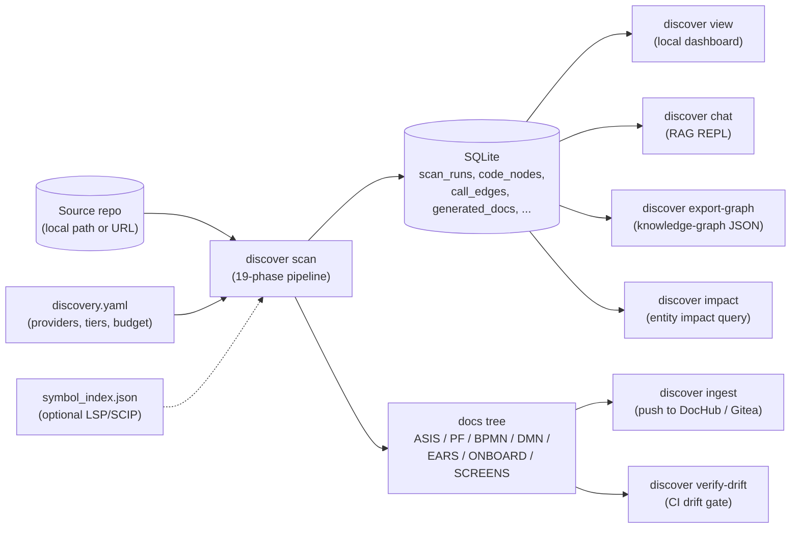
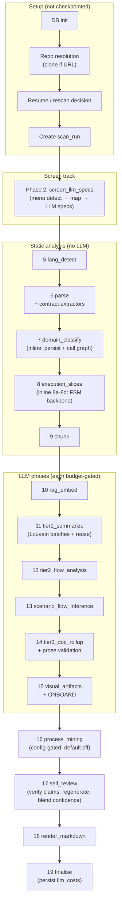
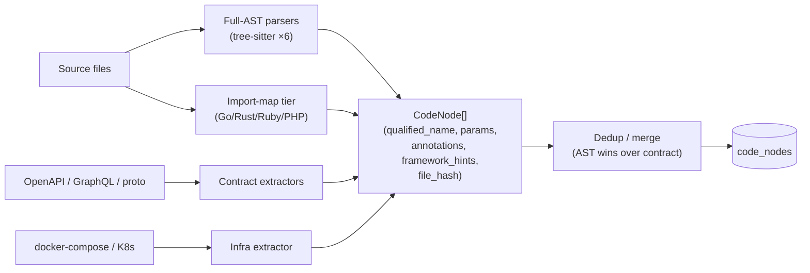
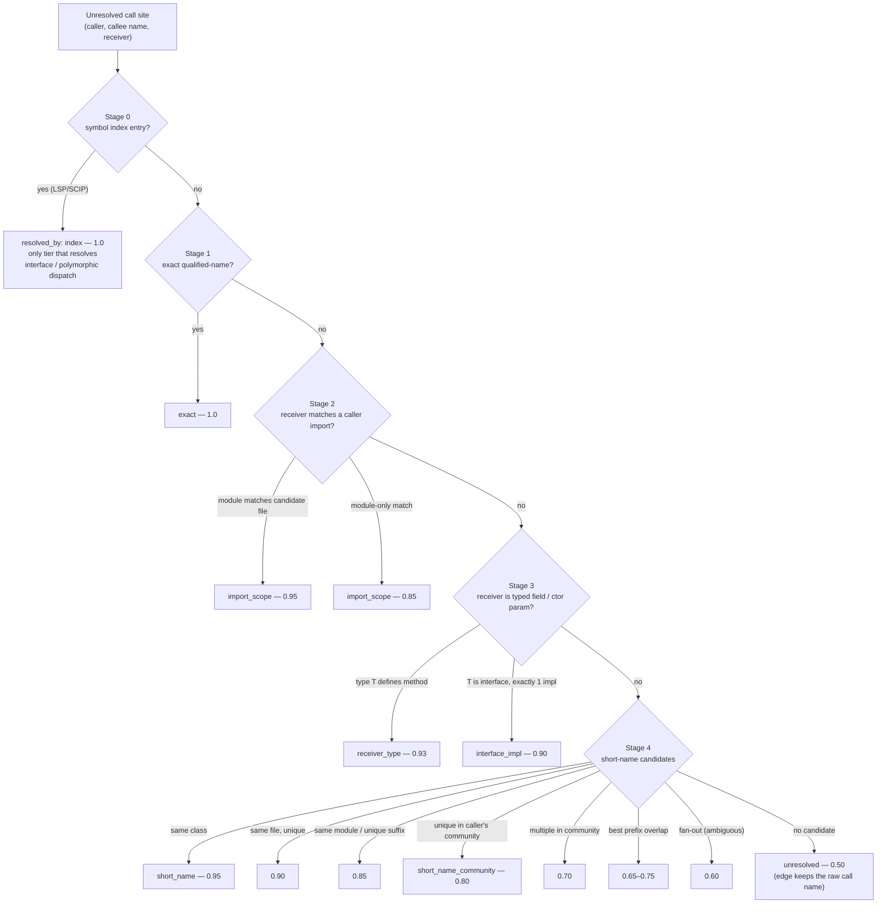
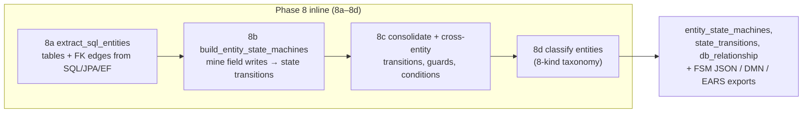
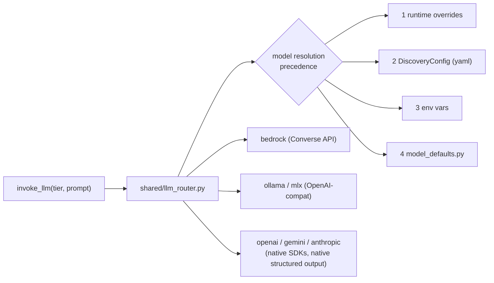
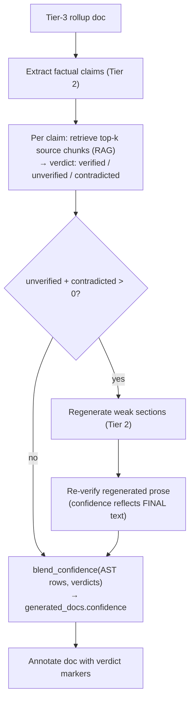
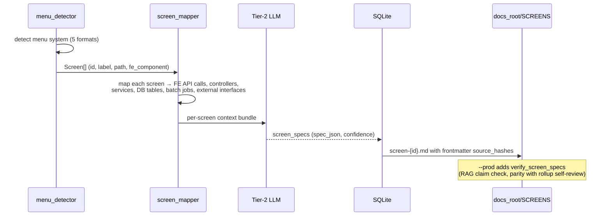

# AI-Discovery — System Logic Review Document

**Audience**: IT developer team (engineering review)
**Date**: 2026-06-06
**Source of truth**: code on `main` @ 7a109a9. Every concrete claim below was verified against the cited module; line numbers are approximate and may drift.
**Korean version**: [system-logic.ko.md](system-logic.ko.md)

---

## Table of Contents

1. [System Overview](#1-system-overview)
2. [End-to-End Pipeline](#2-end-to-end-pipeline)
3. [Parsing Layer](#3-parsing-layer)
4. [Call-Graph Resolution](#4-call-graph-resolution)
5. [Entity / FSM Backbone](#5-entity--fsm-backbone)
6. [LLM Layer](#6-llm-layer)
7. [RAG & Self-Review Loop](#7-rag--self-review-loop)
8. [Screen-Centric Track](#8-screen-centric-track)
9. [Generators & Artifacts](#9-generators--artifacts)
10. [Data Model](#10-data-model)
11. [Confidence Model](#11-confidence-model)
12. [Operational Characteristics](#12-operational-characteristics)
13. [Known Limitations & Review Discussion Points](#13-known-limitations--review-discussion-points)

---

## 1. System Overview

AI-Discovery is a **brownfield reverse-engineering engine**. It takes a source
repository as input and produces SDLC documentation as output: as-is
specifications, process flows, BPMN/DMN/EARS artifacts, screen specs,
onboarding tour guides, and a queryable knowledge graph — all backed by a
SQLite database that records every intermediate result with a confidence
score.

The core design tension it manages: **deterministic static analysis**
(parsing, call graphs, FSM mining — cheap, exact, incomplete) versus
**LLM inference** (summaries, flow narratives, document prose — expensive,
fluent, fallible). The system layers the two: static analysis builds a
fact backbone; a 3-tier LLM pipeline writes prose *constrained by* that
backbone; a self-review pass then verifies the prose *against* the backbone
and the source via RAG, and blends the verdicts into a published confidence
score.



**Key boundaries**

| Boundary | Decision |
|---|---|
| Pipeline never pushes | `discover scan` writes markdown to `docs_root` only; publishing is a separate `discover ingest` step. |
| DB is the system of record | Markdown on disk is a *render* of DB rows (`generated_docs`, `scenario_flows`, …). Re-render is cheap; LLM work is checkpointed. |
| Confidence is never self-asserted | The LLM's own "Confidence: X" line is parsed but **never published**; published confidence comes from deterministic verification (§11). |

---

## 2. End-to-End Pipeline

### 2.1 Phase map

The canonical phase list is `_PHASE_SPECS` in `src/ai_discovery/pipeline.py:54`.
Phases are contiguous integers; non-checkpointed inline operations are
labelled with letter suffixes (8a–8d) in code comments only.

| # | Name | What it does | LLM tier | Gated by |
|---|---|---|---|---|
| – | (setup) | DB init, repo resolution, resume/rescan decision, scan-run creation | – | – |
| 2 | `screen_llm_specs` | Screen-centric track: menu detection → screen→backend mapping → per-screen LLM specs (§8) | Tier 2 | budget; skipped when no menu system detected |
| 5 | `lang_detect` | Per-extension language statistics | – | – |
| 6 | `parse` | Parse all source files into `CodeNode`s; contract extraction (OpenAPI/GraphQL/gRPC); dedup | – | – |
| 7 | `domain_classify` | Domain classification; **inline**: persist nodes, build call graph (§4), extract external systems | – | – |
| 8 | `execution_slices` | Bounded BFS slices from entry points → `Scenario`s; **inline 8a–8d**: SQL entities, FSM mining, cross-entity transitions, entity classification (§5) | – | – |
| 9 | `chunk` | Code chunking for Tier 1 + RAG (respects `config.rag` filters); source text released from memory afterwards | – | – |
| 10 | `rag_embed` | Embed chunks into `sqlite-vec` (`discovery_vectors`); chunk-hash incremental | embedding | budget |
| 11 | `tier1_summarize` | Per-node structured summaries; **Louvain semantic batching** + **fingerprint cross-scan reuse** (§6.4, §12.2) | Tier 1 | budget |
| 12 | `tier2_flow_analysis` | Business flows per domain | Tier 2 | budget |
| 13 | `scenario_flow_inference` | Reconstruct scenario flows from execution slices; `--prod` adds flow verification | Tier 2 | budget |
| 14 | `tier3_doc_rollup` | SDLC docs per domain (`as-is`, `as-is-detail`, `as-is-schema`); deterministic prose validation flags unverifiable `file:line` citations | Tier 3 | budget |
| 15 | `visual_artifacts` | Mermaid sequence/flowchart, BPMN XML, IPO markdown per scenario; ONBOARD tour guides | Tier 2 (onboard narrative) | budget (onboard) |
| 16 | `process_mining` | Process mining & conformance reports | – | `process_mining.enabled` (default off) |
| 17 | `self_review` | Claim verification against RAG; regeneration of weak sections; confidence blending (§7, §11) | Tier 2 | budget |
| 18 | `render_markdown` | Write all markdown to `docs_root` | – | – |
| 19 | `finalise` | Mark scan complete; persist cost ledger; print summary | – | – |

### 2.2 Flow with gates



**Budget gating** (`pipeline.py:_budget_ok`): before each LLM phase, if
accumulated cost ≥ `budget_limit_usd`, the phase is skipped with a warning
and the scan ends in status `budget_exceeded`. Tier loops also receive a
mid-phase predicate (`_budget_exhausted_fn`) so a phase can stop partway.
Cost tracking covers metered cloud providers; local providers are free
(per-model rates in the LLM client, §6.3).

**Checkpointing**: each phase writes a `phase_checkpoints` row
(`running` → `complete`/`failed`). `--resume` continues after the last
completed checkpoint; `--resume-from <n|name>` jumps; `--skip-phases` skips.
Cheap derived phases (8, 9) rebuild rather than persist intermediate state.

---

## 3. Parsing Layer

Two tiers of language support, plus contract extractors that mine API
definitions independently of code.

### 3.1 Full-AST tier (tree-sitter)

| Language | Module | Notable extraction |
|---|---|---|
| Python | `parsers/python_parser.py` | Flask/FastAPI endpoints via decorators, ORM models, state machines |
| Java / Spring | `parsers/java.py` | `@RestController`/`@RequestMapping` endpoints, DI type hints, nested types |
| C# / ASP.NET | `parsers/csharp.py` | attributes, EF navigation properties |
| JavaScript / TypeScript | `parsers/javascript.py` | exports/imports, classes, arrow functions, router constants |
| WebForms | `parsers/webforms.py` | `.aspx` pages + code-behind classes |
| JSP | `parsers/jsp.py` | `.jsp/.jspx` pages, includes, useBean bindings (`jsp_extractor.py`) |

### 3.2 Import-map tier (A-6, regex-based)

`parsers/import_map.py` — **Go, Rust, Ruby, PHP**. Extracts top-level
symbols and imports with conservative regexes; call sites only when a
receiver is explicit. Module separators are normalized to dots
(`a/b` → `a.b`, `a::b` → `a.b`, `A\B` → `A.B`) so Stage-2 import-scoped
call resolution (§4) works identically across languages. This is an
on-ramp, not full AST parity: confidence ceilings are lower and no
endpoint/FSM extraction happens for these languages.

### 3.3 Contract extractors

| Extractor | Input | Output |
|---|---|---|
| `extractors/openapi_extractor.py` | OpenAPI/Swagger files | endpoint nodes, deduped against AST endpoints by `(method, route)` |
| `extractors/graphql_extractor.py` | GraphQL schemas | root operations → endpoints; types → entities |
| `extractors/proto_extractor.py` | protobuf | services/RPCs → endpoints; messages → entities |
| `extractors/external_system_extractor.py` | code (axios/kafka/redis/stripe/… call sites) | typed external-system nodes + edges |
| `extractors/infra_extractor.py` | docker-compose / K8s manifests | backing-service nodes |



Every `CodeNode` carries `file_hash` (SHA-256 of the file at parse time) —
the key that makes incremental re-scan possible (§12.2).

---

## 4. Call-Graph Resolution

`src/ai_discovery/graph/call_graph.py:build_call_graph`. The hard problem:
the same short name exists in many modules, and dynamic dispatch cannot be
resolved statically. The answer is a **staged cascade — first match wins,
higher-precision stages first — with graded confidence** so downstream
consumers can choose their own threshold (BPMN might accept 0.65; a tech
spec flags it for human review).

### 4.1 Resolution cascade



Every edge records `metadata["resolved_by"]` for provenance, and edges are
**deduplicated per `(caller, callee, edge_type)`** keeping the highest
confidence.

### 4.2 Community narrowing (A-3)

The noisy short-name stage is constrained by a two-pass scheme:

1. **Pass 1** — build *file communities* by union-find over only the
   high-confidence edges (stage 0–3, confidence ≥ 0.93). The short-name
   stage never feeds its own input.
2. **Pass 2** — when stage 4 has multiple candidates, restrict to those in
   the caller's community **only if the community is informative** (some
   but not all candidates inside it). Unique-in-community → 0.80; several
   in community → 0.70.

### 4.3 Index structures

| Index | Shape | Used by |
|---|---|---|
| `qualified_index` | qualified name → node (1:1) | Stage 1 |
| `short_name_index` | name → [nodes] (1:n) | Stages 2–4 |
| `field_types_by_class` | class → {field: type} | Stage 3 (DI) |
| `impls_by_base` | interface/base → [impls] | Stage 3 fallback |

### 4.4 Execution slices

`ExecutionSliceBuilder` (`call_graph.py:581`) walks the resolved graph from
each entry point (HTTP endpoint, batch job, CLI command, event consumer)
with **bounded BFS (max depth 5)**, producing `Scenario`s. Each visited node
gets a **multi-signal ranking score** (not a 0–1 confidence — see §11.2):
call order, state transitions, data boundaries, external APIs,
read-after-write. The top-scored nodes (capped at 15) become the scenario's
`primary_path`; conditional fan-outs become alternate paths/gateways.

---

## 5. Entity / FSM Backbone

Inline operations 8a–8d (inside phase 8, not separately checkpointed) build
the **state-first backbone**: which business entities exist, what states
they move through, and which code moves them.



- **8a** — SQL DDL + ORM models yield entities and `db_relationship` rows
  (FK edges with `source ∈ {sql, jpa, ef}`; naming-convention guesses are
  marked `inferred=1`).
- **8b** — state transitions are mined from field-write patterns
  (`status = 'PAID'` style), each carrying trigger function, guard
  expression, and entry points.
- **8c** — entities are consolidated across files/repos via
  `fsm_identity.py` (stable `entity_id`); cross-entity transitions and
  guard conditions are parsed.
- **8d** — every entity gets one of the 8 kinds in the project's entity
  taxonomy (`graph/entity_classifier.py`); all kinds appear in BPMN (lanes
  are actors, not entities — kinds are never skipped).

The backbone powers `discover impact <Entity>`, the DMN decision tables,
EARS requirement templates, and `discover federate` (cross-repo FSM merge
by field-Jaccard similarity, default 0.7).

---

## 6. LLM Layer

### 6.1 Providers × tier slots

Seven providers, each exposing the same four model slots plus embeddings:

| Provider | tier1 | tier2 | tier3d | tier3p | Embeddings |
|---|---|---|---|---|---|
| bedrock | ✓ | ✓ | ✓ | ✓ | ✓ |
| ollama | ✓ | ✓ | ✓ | ✓ | ✓ |
| mlx-gemma / mlx-qwen | ✓ | ✓ | ✓ | ✓ | via OpenAI-compat |
| openai | ✓ | ✓ | ✓ | ✓ | ✓ |
| gemini | ✓ | ✓ | ✓ | ✓ | ✓ |
| anthropic | ✓ | ✓ | ✓ | ✓ | **✗** (set a different `rag.embedding_provider`) |

Slot semantics: **tier1** = high-volume node summaries (cheap/fast);
**tier2** = flow analysis, scenario inference, screen specs, self-review;
**tier3d** = doc rollup (default); **tier3p** = doc rollup under `--prod`
(heavier model). If the `--prod` model isn't enabled in the account,
every rollup fails while the scan still exits 0 — a known operational trap
(see CLAUDE.md "Common Tasks").

### 6.2 Routing



Internal tier names used by the router and the cost ledger:
`fast` (tier1), `standard` (tier2), `expert` (tier3 active), `heavy`
(tier3p), `embedding`.

### 6.3 Structured output & cost

- `LLMClient.invoke_structured(tier, prompt, response_type)` uses
  **tool-use / native JSON mode** per provider, with a JSON-extraction
  fallback (`ai/json_extract.py`). Validation errors retry at the call
  layer.
- Costs are tracked **per (tier, model)** with per-model rates; local
  providers are free. Persisted to `llm_costs` (`UNIQUE(scan_id, tier)`),
  enforced by the budget gates (§2.2).

### 6.4 Louvain semantic batching (A-1)

`ai/semantic_batching.py`: phase-7 call edges collapse into a
confidence-weighted file graph; `networkx.louvain_communities` partitions
it; **each community becomes one structured Tier-1 call** (caps: 10 chunks /
12k tokens per batch; undersized batches pooled by domain). The summarizer
therefore sees a chunk's callers/callees instead of an isolated chunk.
Failure degrades loudly to deterministic domain/path grouping — Tier 1
never crashes or drops chunks.

### 6.5 Ollama lifecycle

For local providers the pipeline pins models in memory across a phase
(`warm(tier, keep_alive=2h)` before phases 10/12/14) and unpins
(`unload`) when switching tiers, bounding VRAM.

---

## 7. RAG & Self-Review Loop

### 7.1 Embedding store

`rag/embedder.py`: chunks → embeddings → **sqlite-vec** virtual table
`discovery_vectors` (`vec0`, float[dim]) + `discovery_chunk_meta`
(file path, qualified name, domain, chunk text, `chunk_hash`).
Re-embedding is **chunk-hash incremental**: same hash ⇒ same embedding
(no call); dimension change forces recreate. `rag/retriever.py` does
cosine top-k.

### 7.2 Self-review (phase 17)



Operational guards: per-document timeout 300 s (ThreadPoolExecutor);
verdicts persist to `review_claims`; phase-14 **prose validation** runs
*before* review and is purely deterministic — it flags `file:line`
citations and qualified symbols that don't exist in the parsed graph.

The downstream `/discover-triage` skill consumes exactly this output:
rows with `confidence < 0.65` or claims in
`('contradicted','unverified')` get human-bounded review.

---

## 8. Screen-Centric Track

Phase 2 — generates **screen specs as user-facing entry points** that link
out to the domain docs (never replacing them).

### 8.1 Menu detection (5 formats, priority order, first match wins)

1. JSON/YAML menu files (`menu.json`, `navigation.yaml`) — leaf entries only
2. TS/JS menu constants (`export const MENU = [...]`) — tree-sitter via `route_parser.py`
3. Framework routing — Vue Router, React Router (incl. JSX `<Routes>`), Angular
4. WebForms — `.aspx` pages, folder hierarchy = menu (fallback)
5. JSP — `.jsp/.jspx` pages, folder hierarchy = menu (fallback)

When nothing matches, `detect_and_build_screens` logs every format tried
and skips screen generation — **never a silent 0-screen run**. Non-menu
screens (modals, wizards, deep links, role-conditional) are a known gap (§13).

### 8.2 Flow



### 8.3 Drift detection

Each spec's frontmatter holds `source_hashes` (path → SHA-256 of every
source file the screen depends on). `discover verify-drift` re-hashes the
current files and exits non-zero when any differ — a CI gate that triggers
regeneration of *only* drifted specs.

---

## 9. Generators & Artifacts

All generator modules live in `src/ai_discovery/generators/` (note:
`output/` is gitignored — never place modules there).

| Generator | Artifact |
|---|---|
| `doc_generator.py` | ASIS rollups + scenario PF docs to disk; doc-type → folder bucketing |
| `bpmn_generator.py` | Mermaid sequence + flowchart, BPMN 2.0 XML, IPO markdown, entity-backbone Mermaid |
| `dmn_generator.py` | DMN decision tables from guarded transitions |
| `ears_generator.py` | EARS requirement templates from state changes |
| `onboarding_generator.py` | ONBOARD tour guides — deterministic call-graph walk + Tier-2 narrative, `ONBOARD/{slug}-onboard-{domain}.md` |
| `screen_doc_writer.py` | per-screen markdown with drift frontmatter |
| `graph_export.py` | canonical knowledge-graph JSON (`discover export-graph`) |
| `push.py` | DocHub / Gitea publication (used by `discover ingest`) |

Output tree:

```text
docs_root/output-{slug}/
  ASIS/      as-is*.md                  (domain rollups)
  ASSD/      as-is-schema*.md           (schema detail)
  PF/        process-flow-*.md          (scenarios: Mermaid + BPMN + IPO)
  EARS/      entity-ears.md
  DMN/       entity-decisions.md
  ONBOARD/   {slug}-onboard-{domain}.md
  SCREENS/   screen-*.md                (with source_hashes frontmatter)
  entity_state_machines.json / cross_entity_transitions.json
  entity_backbone.mmd
  knowledge-graph-{slug}.json           (export-graph)
```

Diagram strategy (recorded decision): **Mermaid primary** (renders on
GitHub/GitLab/Gitea natively), BPMN XML + bpmn.io supplemental;
draw.io / PlantUML / D2 rejected.

---

## 10. Data Model

SQLite, `SCHEMA_VERSION = 14` (`src/ai_discovery/db.py`), WAL mode.
Key relationships:

```mermaid
erDiagram
    scan_runs ||--o{ code_nodes : "scan_id"
    scan_runs ||--o{ call_edges : "scan_id"
    scan_runs ||--o{ domains : "scan_id"
    scan_runs ||--o{ generated_docs : "scan_id"
    scan_runs ||--o{ scenario_flows : "scan_id"
    scan_runs ||--o{ screens : "scan_id"
    scan_runs ||--o{ entity_state_machines : "scan_id"
    scan_runs ||--o{ llm_costs : "scan_id"
    scan_runs ||--o{ phase_checkpoints : "scan_id"
    code_nodes ||--o{ call_edges : "caller_id / callee_id"
    code_nodes ||--o{ node_summaries : "node_id"
    generated_docs ||--o{ review_claims : "doc_id"
    screens ||--o{ screen_specs : "screen_id"
    screens ||--o{ screen_source_hashes : "screen_id"
    entity_state_machines ||--o{ state_transitions : "entity_id"

    code_nodes {
        string qualified_name
        string node_type
        string domain
        string file_hash "SHA-256, A-2 reuse key"
    }
    call_edges {
        float confidence "0.5 - 1.0"
        string resolved_by "index|exact|import_scope|..."
    }
    generated_docs {
        string doc_type "as-is | as-is-detail | as-is-schema | ..."
        float confidence "blended, never self-asserted"
        string push_status "local | pushed | failed"
    }
    review_claims {
        string status "verified | unverified | contradicted"
    }
    scenario_flows {
        string structured_steps_json "PHASE/LOOP/GATEWAY/PROCESS tree"
        string bpmn_xml
        string mermaid
    }
    entity_state_machines {
        string entity_id "stable cross-scan identity"
        string metadata_json "entity_kind, denormalized_fields"
    }
    db_relationship {
        string source "sql | jpa | ef"
        int inferred "1 = naming-convention guess"
    }
    llm_costs {
        string tier "fast|standard|expert|heavy|embedding"
        float est_usd
    }
```



Supporting tables not shown: `business_flows` (tier-2 flows),
`state_transitions` raw rows, `schema_version`, plus the RAG store
(`discovery_vectors` sqlite-vec virtual table + `discovery_chunk_meta`).

`scan_runs.status` lifecycle:
`running → llm_complete → completed` | `push_failed` | `budget_exceeded`.

---

## 11. Confidence Model

Three *distinct* confidence systems — same word, different semantics.
Reviewers should keep them separate.

### 11.1 Call-edge confidence (0.5–1.0)

Set by the resolution stage that matched (§4.1). Interpretation: the
probability that this edge points at the right callee. Consumers threshold
it (project target: ≤ 15 % of edges below 0.65).

### 11.2 Execution-node score (unbounded ranking score — *not* 0–1)

`ExecutionSliceBuilder._score_node` (`call_graph.py:670`):

```text
score = max(0, 5 − depth)            # call order: entry +5, −1 per level
      + 4   if state transition present
      + 3   if node type ∈ {DB, QUEUE}
      + 2   if node type = EXTERNAL_API
      + 3   if read-after-write (node name mentions a field written upstream)
```

Stored in `ExecutionNode.confidence` but used **only to rank** nodes when
selecting the ≤ 15-node `primary_path`. Do not compare it with 11.1/11.3.

### 11.3 Document confidence (0.0–1.0, published)

`ai/rollup.py:blend_confidence` — deterministic blend of AST-verified rows
and self-review verdicts:

```text
n_ast   = AST-verified rows (endpoints, field lists)   → weight 1.0 each
verified / unverified / contradicted claims            → 1.0 / 0.5 / 0.0

confidence = (n_ast + verified·1.0 + unverified·0.5 + contradicted·0.0)
             ───────────────────────────────────────────────────────────
                          n_ast + verified + unverified + contradicted

if the denominator is 0  → UNVERIFIABLE_CONFIDENCE = 0.3
```

If self-review hasn't run (budget/skip): `unreviewed_confidence` =
**0.6** when AST facts exist, else **0.3**. Two invariants worth defending
in review: (a) the LLM's self-asserted confidence line is never published;
(b) "no evidence" maps to *low* confidence, not high — a doc whose claims
cannot even be extracted must not ship as certain.

Screen specs default to 0.8 and are updated after `--prod` verification.

---

## 12. Operational Characteristics

### 12.1 Resume & rescan

- `--resume` — continue after the last completed `phase_checkpoints` row.
- `--rescan` same-SHA fast path — if the commit is unchanged, the prior
  scan completed, and cached docs exist, parsing and **all LLM tiers are
  skipped**; markdown is re-rendered from DB.
- `--skip-phases` — explicit skips; phases 8–9 rebuild cheaply when needed.

### 12.2 Incremental re-scan (A-2)

Before Tier-1 summarization, `reuse_prior_summaries` copies summaries from
the latest prior scan for every node whose
`(qualified_name, file_path, file_hash)` triple is unchanged (blank hashes
never match, so reuse cannot cross a real change). An incremental re-scan
pays LLM cost only for files that actually changed — combined with chunk-
hash incremental embeddings (§7.1) and the drift checker (§8.3), the
steady-state cost of keeping docs current is proportional to churn, not
repo size.

### 12.3 Memory

After phase 9, in-memory `node.source_code` is released (the text is
already durable in `code_nodes`), bounding peak RSS before the
embedding/LLM phases.

### 12.4 Failure stance

- Menu detection failure → explicit "formats tried" log, never silent.
- Louvain failure → loud fallback to deterministic grouping.
- Self-review timeout → per-doc 300 s cap, doc keeps unreviewed confidence.
- `--prod` with an unavailable tier3p model → every rollup fails while the
  scan exits 0; detectable via repeated `Rollup failed … model identifier
  is invalid` log lines. (Improvement candidate — §13.)

---

## 13. Known Limitations & Review Discussion Points

Items the developer team should debate; each is a real, observed boundary
of the current design.

| # | Topic | Current state | Question for review |
|---|---|---|---|
| 1 | **Non-menu screens** | Modals, wizards, deep links, role-conditional screens are invisible to all 5 menu formats. | Is folder-based fallback coverage acceptable, or do we need a component-graph heuristic? |
| 2 | **Dynamic dispatch without an index** | Stage 0 (LSP/SCIP) is the only tier resolving polymorphism; heuristics top out at interface→single-impl (0.90). | Should producing `symbol_index.json` become a first-class pipeline step per language? (LSP-index production is a known open item.) |
| 3 | **Import-map tier ceiling** | Go/Rust/Ruby/PHP get symbols + imports only — no endpoints, no FSM mining. | Which of the four merits promotion to full AST first, based on corpus demand? |
| 4 | **`--prod` rollup failure exits 0** | Tier-3 failures are logged but don't fail the scan. | Should N consecutive rollup failures flip the scan status (CI-visible)? |
| 5 | **Execution-node score semantics** | An unbounded ranking score stored in a field named `confidence` (§11.2). | Rename the field, or normalize to 0–1? Cheap now, confusing later. |
| 6 | **Read-after-write heuristic** | Matches field name *inside the node name* only (`call_graph.py:701`) — crude. | Worth upgrading to source-text scan, or is ranking-only usage tolerant enough? |
| 7 | **Cost visibility for local runs** | Local providers tracked as $0; token counts still recorded. | Do we want wall-clock/token budgets for Ollama runs (long scans on laptops)? |
| 8 | **Self-review extraction blind spot** | Claims the extractor misses are never verified — they inherit the blended score without scrutiny. | Sample-audit unextracted prose periodically (`/discover-triage` covers flagged rows only)? |
| 9 | **Cross-repo federation depth** | `discover federate` merges FSMs at artifact level (field-Jaccard ≥ 0.7); choreography view + contract ingestion remain open. | Priority relative to single-repo accuracy work? |
| 10 | **BFS depth cap = 5** | Execution slices truncate deeper chains; long sagas lose their tails. | Make depth adaptive (e.g., follow high-confidence edges deeper)? |

### Suggested review agenda (90 min)

1. §2 pipeline walk-through — 15 min
2. §4 + §11 resolution & confidence semantics — 25 min (items 2, 5, 6)
3. §7 self-review loop guarantees — 15 min (item 8)
4. §8 screen track coverage — 10 min (item 1)
5. Operational traps — 10 min (items 4, 7)
6. Roadmap trade-offs — 15 min (items 3, 9, 10)
